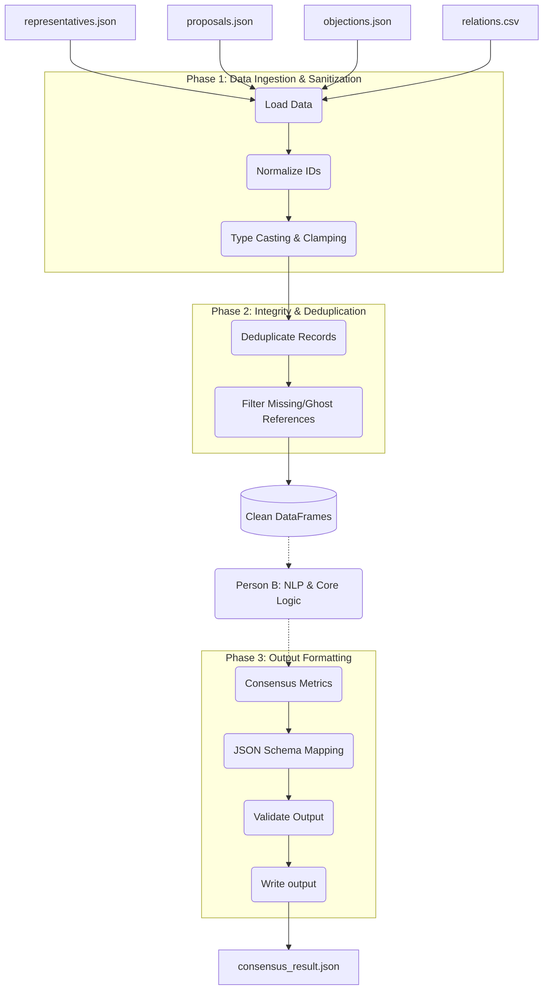

# Person A: Data Engineering Workflow — ✅ COMPLETE

This document outlines the step-by-step workflow for the Data Engineer (Person A) to build, test, and finalize the data pipeline for the Phantom Consensus engine.

## 📊 Pipeline Architecture (Data Flow)

---

## 📋 Task Checklist & Implementation Steps

### 1. Vectorization & Performance (Issue 20) ✅
- [x] **Goal:** Replace slow `.apply()` functions with Pandas vectorized operations.
- [x] **Implementation:**
  - `normalize_id_series()`: Uses `.astype(str).str.strip().str.lower()` — no Python-level loops
  - `clean_influence_series()`: Uses `pd.to_numeric(..., errors='coerce').fillna(0).clip(0, 100).astype(int)`
  - `clean_severity_series()`: Maps categorical strings then uses `pd.to_numeric` + `.clip(0, 10)`
  - `clean_priority_series()`: Uses `pd.to_numeric` + `.clip(0, 10)`
  - `clean_score_series()`: Uses `pd.to_numeric` + `.clip(0, 100)`
  - `clean_probability_series()`: Uses `pd.to_numeric` + `.fillna(1.0).clip(0, 1)` (worst-case default)

### 2. Referential Integrity (Issues 8 & 9) ✅
- [x] **Goal:** Ensure no "ghost" proposals or objections exist.
- [x] **Implementation:**
  - Valid rep set built immediately after cleaning reps
  - Ghost sponsor proposals filtered (`prop_005` with `rep_099` → dropped)
  - Ghost objections filtered (both `rep_id` and `proposal_id` validated)
  - Dedup: reps by highest influence, proposals by highest priority, objections by highest severity
  - Relations deduped by latest `last_interaction` date

### 3. Data Structure Verification (Issue 7) ✅
- [x] **Goal:** Ensure DataFrames are perfectly structured for Person B.
- [x] **Implementation:**
  - All numeric columns (`influence`, `severity`, `trust`, `betrayal_prob`) are strictly `int64`/`float64`
  - Text columns (`reason`) preserved as strings and NaN filled with empty string for NLP
  - Diagnostic prints show row counts and valid IDs after cleaning

### 4. Output Formatting & Validation (Issue 18) ✅
- [x] **Goal:** Output strict JSON format.
- [x] **Implementation:**
  - All output values are pure Python `str` / `list` types (explicit `str()` casting)
  - `validate_output()` function checks: valid IDs, no duplicates, alliance pairs
  - Empty edge cases return empty lists (not null/crash)

---

## 🛠️ Verification Results

### Data Cleaning Summary
| Dataset          | Raw Rows | Clean Rows | Issues Handled                                |
|------------------|----------|------------|-----------------------------------------------|
| Representatives  | 8        | 6          | `REP_001` + ` rep_004` deduped, null influence |
| Proposals        | 6        | 4          | `prop_005` ghost sponsor, `prop_003` duplicate |
| Objections       | 8        | 6          | `rep_099` ghost, severity=-3→0, "high"→8       |
| Relations        | 16       | 15         | Duplicate `rep_001→rep_002`, "high" in rivalry  |

### Strategic Decisions
| Check              | Result                                      |
|--------------------|---------------------------------------------|
| Trojan Horses      | `rep_005` (0.825), `rep_006` (0.775) excluded |
| Faction Infiltrators | None detected in sample data               |
| Poison Pills       | All proposals viable (viability > 0)         |
| False Friends      | `rep_006→rep_001` filtered (asymmetric)      |
| Alliances          | `[rep_001, rep_004]` — bidirectional trust    |
| Supporters         | `rep_004` — only safe non-objecting rep       |

---

## 🤝 Hand-off to Person B

Person B can now:
1. Import `load_and_clean_data()` to get clean DataFrames
2. Access `df_objs['reason']` column (preserved as strings) for NLP sentiment analysis
3. Plug `analyze_objection_text()` into the `compute_metrics()` phase
4. The `severity` column already handles nulls, so NLP can augment/override it
